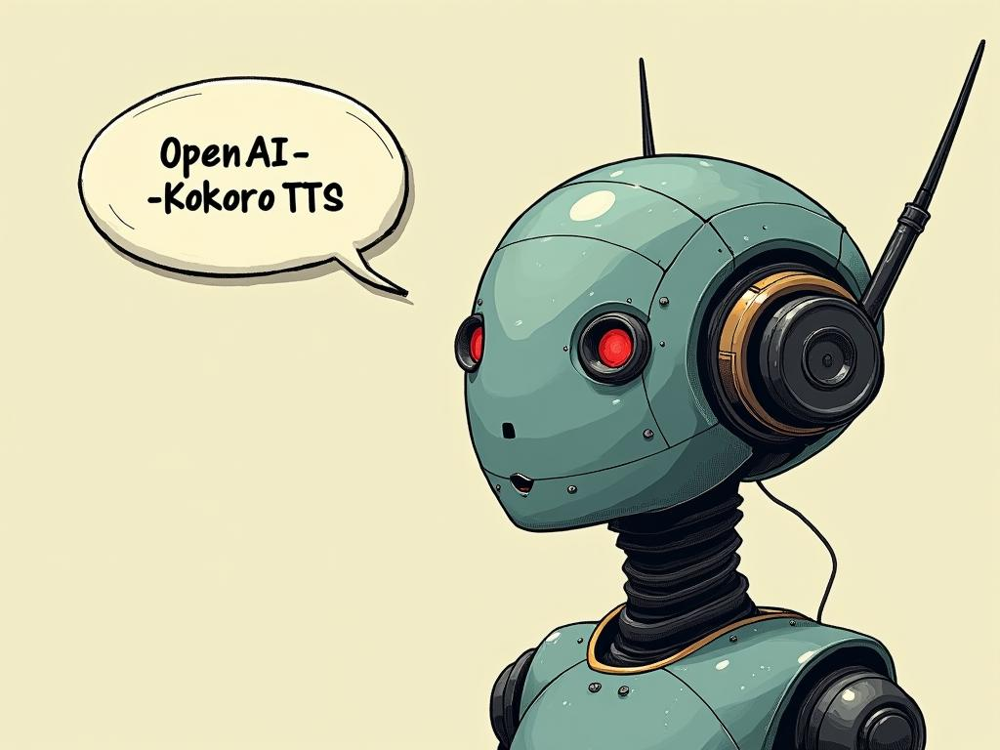

# openai-kokoro-tts



Welcome to **openai-kokoro-tts**! This project provides a user-friendly Flask-based API for generating high-quality text-to-speech (TTS) audio using **Kokoro-TTS**, a flexible and powerful TTS engine.

---

## Table of Contents

- [Prerequisites](#prerequisites)
- [Deployment Instructions](#deployment-instructions)
  - [Using Docker Compose (Recommended)](#using-docker-compose-recommended)
- [Development Setup with `uv`](#development-setup-with-uv)
  - [Installation](#installation)
  - [Environment Configuration](#environment-configuration)
  - [Setting Up Models](#setting-up-models)
  - [Running the Application](#running-the-application)
- [API Endpoints](#api-endpoints)
  - [/v1/audio/speech](#v1audiospeech)
  - [/v1/models](#v1models)
- [TODO](#todo)
- [License](#license)

---

## Prerequisites

Before getting started, ensure you have the following installed on your system:

- **Git**: For cloning the repository.
- **Python 3.10 or newer**: Required for development.
- **Docker**: Optional but recommended for production deployment.

---

## Deployment Instructions

### Using Docker Compose (Recommended)

```bash
git clone https://github.com/matthewhand/openai-kokoro-tts
cd openai-kokoro-tts
docker-compose up --build -d
```

The API will be available at `http://localhost:9090`.

---

## Development Setup with `uv`

`uv` is a modern tool for managing Python environments, dependencies, and project workflows. Follow these steps to set up your development environment with `uv`.

---

### Installation

#### **macOS and Linux**

Run the following command to install `uv`:

```bash
curl -LsSf https://astral.sh/uv/install.sh | sh
```

Alternatively, use Homebrew:

```bash
brew install uv
```

#### **Windows**

Run this command in PowerShell to install `uv`:

```powershell
powershell -ExecutionPolicy ByPass -c "irm https://astral.sh/uv/install.ps1 | iex"
```

---

### Environment Configuration

1. **Copy `.env.example` to `.env`**:
   ```bash
   cp .env.example .env
   ```

2. **Update the `.env` File**:
   - Set a secure value for `API_KEY` to protect your API endpoints:
     ```env
     API_KEY=your_secure_api_key_here
     ```
   - Adjust other settings (e.g., `PORT`, `MODEL_PATH`) based on your requirements.

---

### Setting Up Models

#### **Ubuntu (Automated Setup)**

Run the included `setup_models.sh` script:

```bash
bash setup_models.sh
```

This script will:
1. Verify and install required tools such as Git LFS and `espeak-ng`.
2. Clone the Kokoro-82M model repository into the `models/kokoro` directory.
3. Create the `voices` directory (if missing).

#### **macOS and Windows (Manual Setup)**

If you're not on Ubuntu, follow these steps to set up the models manually:

1. **Install Git LFS**:
   - **macOS**:
     ```bash
     brew install git-lfs
     git lfs install
     ```
   - **Windows**:
     Download and install Git LFS from [Git LFS website](https://git-lfs.github.com/).

2. **Clone the Kokoro-82M Repository**:
   ```bash
   git clone https://huggingface.co/hexgrad/Kokoro-82M models/kokoro
   ```

3. **Verify Directory Structure**:
   Ensure the `models/kokoro/kokoro-v0_19.pth` file exists, and create the `voices` directory if it’s missing:
   ```bash
   mkdir -p voices
   ```

4. **Install System Dependencies**:
   - **macOS**:
     ```bash
     brew install espeak-ng
     ```
   - **Windows**:
     Install [espeak-ng](https://github.com/espeak-ng/espeak-ng).

---

### Running the Application

1. **Create a Virtual Environment**:
   Navigate to the project directory and initialize a `uv` project:
   ```bash
   uv init
   uv venv .venv
   ```

2. **Sync Dependencies**:
   Install all Python dependencies specified in the `pyproject.toml`:
   ```bash
   uv sync
   ```

3. **Run the Flask Application**:
   ```bash
   uv run openai_kokoro_tts/server.py
   ```

The server will start, and the API will be available at `http://localhost:8000`.

---

## API Endpoints

### `/v1/audio/speech`

Primary route for generating speech from text input. Requires an API key in the request header as a Bearer token.

- **URL**: `/v1/audio/speech`
- **Method**: `POST`
- **Headers**: `Authorization: Bearer <API_KEY>`
- **Data (JSON)**:
  - `text` (string): The input text to convert to speech.
  - `voice` (string, optional): Voice model to use (default: "Sky").
  - `response_format` (string, optional): Output audio format (default: `mp3`).

---

### `/v1/models`

Route for listing all available Kokoro-TTS voice models.

- **URL**: `/v1/models`
- **Method**: `GET`
- **Headers**: `Authorization: Bearer <API_KEY>`
- **Response**:
  - A JSON object containing an array of available models.
- **Example Response**:
    ```json
    {
      "models": [
        "af",
        "af_bella",
        "af_sarah",
        "am_adam",
        "am_michael",
        "bf_emma",
        "bf_isabella",
        "bm_george",
        "bm_lewis",
        "af_nicole",
        "af_sky"
      ]
    }
    ```

---

## TODO

- [x] Flask service
- [ ] Publish to Docker registry

---

## License

This project is licensed under the [MIT License](LICENSE).
